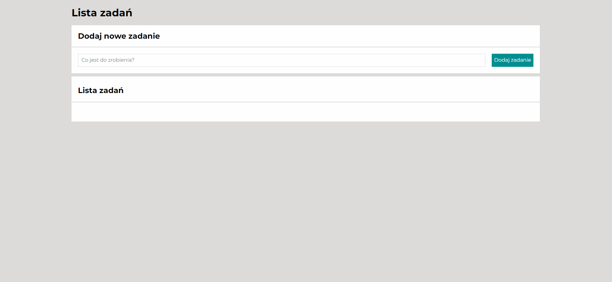

# Tasks List

Hello! 
I would like to present a simple task list application. This application is easy and intuitive. Just write in the field what you have to do and then press the “add task” button or “enter” on the keyboard. Below you will see the typed tasks. You can mark them as completed or uncompleted (green button) or delete them (red button). 
There are also two additional buttons - the first shows the completed task and the second marks all tasks as completed.

Below is the presentation, link to the application and the technologies used.

## Demo
https://am97veb.github.io/Tasks-list/

## Technologies
Java Script ECMAScript 6

CSS3:
- BEM convention
- Grid
- Media Queries
- Normalize.css

